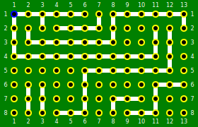

# BreadBoardCad

## The web service for creating versionable breadboard projects.

How to add: https://github.com/marketplace/actions/net-code-coverage-badge

### Open the deployed API from the browser
- **cd opt/projectBBCAD/** - go to the project's deployment directory
- **dotnet BBCAD.API.dll** - start the application manually
- [http://3.79.24.12:4800](http://3.79.24.12:4800)
- [https://3.79.24.12:4801/aw320-ee241](https://3.79.24.12:4801)

### Virtual Machine Access
- [Instances](https://eu-central-1.console.aws.amazon.com/ec2/home?region=eu-central-1#Instances:) 
- [CLI](https://eu-central-1.console.aws.amazon.com/ec2-instance-connect/ssh?connType=standard&instanceId=i-0380e7fb0f1be7c5e&osUser=ubuntu&region=eu-central-1&sshPort=22#/)

Apply JavaScript image control as described [here](https://learn.microsoft.com/en-us/aspnet/core/blazor/javascript-interoperability/?view=aspnetcore-7.0).

### Task: [Research on AWS Secrets Manager](https://github.com/K-S-K/BreadBoardCad/issues/11)
### AWS: [What is CodeDeploy?](https://docs.aws.amazon.com/codedeploy/latest/userguide/welcome.html) 
### AWS: [How to load .NET configuration from AWS Secrets Manager](https://aws.amazon.com/ru/blogs/modernizing-with-aws/how-to-load-net-configuration-from-aws-secrets-manager/)

### Add Git Tag
- **git tag -a M1 e3afd034 -m "Tag Message"** - tag the commit with this command
- **git push origin M1** - specify the tag in the git push command

### List Git History
- **git log --oneline --graph -10**

### oi oi-icons
- https://www.appstudio.dev/app/OpenIconic.html
- https://learn.microsoft.com/en-us/answers/questions/1001680/oi-oi-blazor
- https://jonhilton.net/conditional-blazor-css/
- https://github.com/iconic/open-iconic

### Useful about DI
- https://stackoverflow.com/questions/67735019/how-to-use-dependency-injection-in-a-class-library
- https://stackoverflow.com/questions/62733836/how-to-use-dependency-injection-in-net-standard-project
- https://gkama.medium.com/dependency-injection-di-in-net-core-and-net-5-c-unit-tests-935651a99a2d
- https://learn.microsoft.com/en-us/aspnet/core/fundamentals/dependency-injection?view=aspnetcore-7.0

### Something about tests
- [Unit testing C# with NUnit and .NET Core](https://learn.microsoft.com/en-us/dotnet/core/testing/unit-testing-with-nunit)

### AppSettings Kestrel customization
- https://learn.microsoft.com/en-us/aspnet/core/fundamentals/servers/kestrel/endpoints?view=aspnetcore-7.0

dotnet --list-sdks
